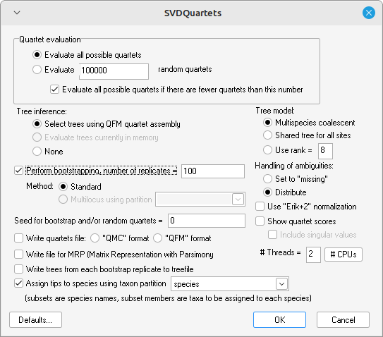

Species tree estimation is mainly based on the multispecies coalescent model (MSC; [Liu et al. 2021](https://doi.org/10.1007/978-1-4939-9074-0_7)). This model accomodates gene trees within species trees, while allowing for incomplete lineage sorting (ILS).

<p align="center">
    
    <figcaption>Modified from (<a href="https://doi.org/10.1007/978-1-4939-9074-0_7">Liu et al. 2021</a>)</figcaption>
</p>

Species tree inference methods can be broadly classified into summary (also termed "heuristic") and full-likelihood approaches. The first class reduce the information in the sequences to summary statistics, while the second perform estimations directly from the alignments. As a result, the summary-based approaches are much more faster than full-likelihood methods. Here, we will use two summary-based methods, one of them takes previously reconstructed gene trees as input data (ASTRAL), and the other one (SVDquartets) can work with single-nucleotide-polymorphism (SNPs) datasets directly (i.e., gene tree inference is not needed).

## Species tree inference based on gene tree input data: ASTRAL

<span style="font-variant: small-caps;">astral</span> belongs to a family of species tree methods known as two-step because it uses estimated gene trees from sequence alignments. Here, we will use the maximum likelihood trees inferred from the 388 alignments.

Download the software from [GitHub](https://github.com/smirarab/ASTRAL/archive/refs/heads/master.zip), or in Unix you can type in the terminal:

```sh
git clone https://github.com/smirarab/ASTRAL.git
```

This program is written in Java, so you need to [install Java first](https://www.java.com/en/download/help/download_options.html). To run the sofware, execute:

```sh
java -jar astral.5.7.8.jar
```

This will print the list of available options. If no errors are printed, the installation was succesfull. The following command estimates a species tree from input gene trees:

```sh
java -jar astral.5.7.8.jar -i monitors_trees.tre -o monitor_sptree.tre
```

- `-i`: file containing input gene trees in newick format (a single file where each gene tree is in a different line)
- `-o`: filename for storing the output species tree

As this method estimates an unrooted tree, it is advisable to include a known outgroup species.


## Species tree inference based on SNP data: SVDquartets

`svdquartets` is an algorithm that computes species trees directly from SNP data. However, it is not a full-likelihood approach since the data is summarized as pooled site-pattern counts. This algorithm is implemented in <span style="font-variant: small-caps;">PAUP*</span> (it can be downloaded from [http://phylosolutions.com/paup-test/](http://phylosolutions.com/paup-test/)).

We will use a SNPs matrix collected through RADseq from species belonging to the *Liolaemus kingii* group. This group comprises lizards distributed in the Patagonian Steppe and is characterized by a complex diversification history as a result of rapid diversifications and gene flow between species ([Sánchez et al. 2023](https://doi.org/10.1093/sysbio/syad019)).

There are three ways to use PAUP: 

1. Interactively from a GUI (Graphical User Interface; i.e. an interface that uses icons, menus, and the mouse)
2. Interactively in the terminal (CLI, command line interface); i.e. entering commands one by one to read the data and execute the analysis
3. Including all the necessary commands in the sequence file and calling this file from the terminal to automatically read and execute the analysis

Windows and Linux users can use the the GUI version that gives you an friendly interface (command line users, see below). Open PAUP and load the file `liolaemus_snps.nex` containing the SNPs (go to <button>File</button> &rarr; `Open`). Next, define the outgroup sequence, it is `lineomaculatus`; go to <button>Data</button> &rarr; `Define outgroup` and select this taxa. To perform the SVDq analysis go to <button>Analysis</button> &rarr; `SVDQuartets`, the following window must appear: 

<p align="center">
    
</p>

Select the same options and execute the analysis, it should be finish quickly.
A species tree with support values will appear on the screen, if you want to save this tree to a file go to <button>Trees</button> &rarr; `Save trees to file`, specify a name for the file and select the Newick format at the bottom of the window.


In case of looking to use a command line options, then simply open paup executable (double click), and type:

```sh
cd /my/path/to/data
execute liolaemus_snps.nex
```

This will load the input data into PAUP. Then, define outgroup, run SVDquartets including 100 bootstrap pseudoreplicates and save the tree using the commands:

```sh
outgroup lineomaculatus_0 lineomaculatus_1;
svdq evalQuartets=random nquartets=100000 taxpartition=species bootstrap=standard nreps=100 nthreads=2;
rootTrees rootMethod=outgroup;
savetrees file=SVDquartets.tre format=Newick brlens=yes
```

- `outgroup`: define outgroup samples in the matrix
- `svdq`: calls the SVDquartets algorithm
- `evalQuartets`: use "x" random quartets (number specified in the next flag)
- `nquartets`: number of quartets to sample
- `taxpartition`: this is the partition that specifies the individual-species associations (already included at the bottom of the `.nex` matrix, you can check this in a text editor, e.g. Notepad)
- `bootstrap`: perform standard bootstrap
- `nreps`: number of pseudoreplicates for bootstrap support
- `nthreads`: number of threads to run in parallel
- `rootTrees`: root tree using the outgroup
- `savetrees`: save trees under `SVDquartets.tre` name
