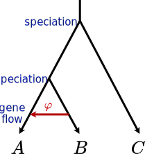

<script type="text/javascript" charset="utf-8" 
src="https://cdn.mathjax.org/mathjax/latest/MathJax.js?config=TeX-AMS-MML_HTMLorMML,
https://vincenttam.github.io/javascripts/MathJaxLocal.js"></script>


Phylogenetic networks are an extension of phylogenetic trees used to model gene flow events between species or populations (see the figure). Specifically, these  events are modelled by reticulation edges that summarizes gene flow that might have occurred over a period of time into a single instantaneous event. These edges have a parameter associated ($\varphi$) that represents the proportion of alleles transferred during the entire period of gene flow.

<p align="center">
    
</p>
 
A popular method to estimate phylogenetic networks is <span style="font-variant: small-caps;">PhyloNetworks</span> ([Solís-Lemus et al. 2017](https://doi.org/10.1093/molbev/msx235)). It is based on a pseudolikelihood function over concordance factors (CFs) of quartets of taxa (four taxa), wich increase computational tractability. CFs are calculated as the proportion of gene trees supporting the three possible splits in a given quartet:
 
<p align="center">
    
    <figcaption>CFs calculation (<a href="https://doi.org/10.1093/sysbio/syaa005">Olave and Meyer 2020</a>)</figcaption>
</p>

A CF table has to be obtained first, either from gene trees or SNP datasets. Here, we will go through both options. 


## Getting started: install Julia and <span style="font-variant: small-caps;">PhyloNetworks</span>

<span style="font-variant: small-caps;">PhyloNetworks</span> is a package of Julia, an interactive programming language (like R). To install Julia, go to [http://julialang.org/downloads/](http://julialang.org/downloads/).

To install the package, first open a terminal and type:

```sh
julia
```

Now we are inside Julia. To install the package type:

```julia
Pkg.add("PhyloNetworks");
using PhyloNetworks; # to load the package, analogous to R's `library(package)`
```

Let's load a toy tree with the `readTopology()` function to check that the package is correctly installed
```julia
net = readTopology("(A,(B,(C,D)));");
net
# HybridNetwork, Rooted Network
# 6 edges
# 7 nodes: 4 tips, 0 hybrid nodes, 3 internal tree nodes.
# tip labels: A, B, C, D
# (A,(B,(C,D)));
```

We loaded a tree but is says it is a network. This is not an error, by definition, trees are networks without reticulation edges.

## Calculation of Concordance Factors using gene trees

To compute CF from gene trees we will use the 388 gene trees we estimated using raxml. The file monitors_trees.tre has all 388 gene trees in newick format. Load them into Julia using:

```julia
cd("my/path/here")
genetrees = readMultiTopology("monitors_trees.tre")
```

Now we can compute the CFs using
```julia
q,t = countquartetsintrees(genetrees);
```

Now lets create a data frame with the obtained q and t, and export the CF table.

```julia
df = writeTableCF(q,t)
using CSV
CSV.write("CF_fromGeneTrees.csv", df)
CF = readTableCF("CF_fromGeneTreesF.csv")
```


## Calculation of Concordance Factors from SNP data


It is also possible to get a CF table overpassing gene tree reconstructions, by simply having SNP data as input. Note that each SNP is assumed to be unlinked. Thus, if you have a dataset such as RADseq you want to randomly sample one SNP per locus. For whole genome sequences, sample one SNP separated far enough to reduce linkage, for example 1 SNP every 10 Kb or 50 Kb. 

Different R functions were developed to compute the table of CFs directly from a SNPs matrix ([Olave and Meyer 2020](https://doi.org/10.1093/sysbio/syaa005)), which we will be using here on the *Liolaemus* dataset.

First, clone the contents from [here](https://github.com/melisaolave/SNPs2CF) and install [R](https://cran.r-project.org) and [Rstudio](https://posit.co/download/rstudio-desktop/), if you don't have them yet.

Now, open Rstudio and run this code

```R
source("my/path/to/functions.R")
setwd("my/path/to/working/directory")

# function to convert vcf into phylip format
vcf2phylip(wd=getwd(), vcf.name="liolaemus_snps.vcf", total.SNPs=8645, random.phase = T, replace.missing = T, output.name=NULL, cores=1)

#calculate CF
SNPs2CF(seqMatrix="liolaemus_snps.phy", ImapName="Imap.txt", outgroupSp="lineomaculatus",
         indels.as.fifth.state=F,  
         bootstrap=T, boots.rep=100, 
         outputName="SNPs2CF.csv",
         n.quartets=100, between.sp.only=T,
         save.progress=F,
         cores=1)

```

Once you got the CF table, now you are ready to get a network using PhyloNetworks! Return to Julia and run

```julia
CF = readTableCF("SNPs2CF.csv")
```
## Network estimation

Now we return to Julia. We will load the CF table and an estimate of the species tree. This can be the tree inferred with `svdquartets`

```julia
sppTree = readTopology("SVDquartets.tre");
```

Now we are ready to estimate a network. This will be accomplished with the `snaq!()` function. It estimates a network that fits observed quartet concordance factors (CFs) using maximum pseudo-likelihood. The argument `hmax` determines the maximum number of hybridizations allowed.

```julia
net_h0 = snaq!(sppTree, CF, hmax = 0, filename = "net0", runs = 1)
net_h1 = snaq!(net_h0, CF, hmax = 1, filename = "net1", runs = 1)
```

Let's take a look to the obtained network
```julia
Pkg.add("PhyloPlots") # to visualize the networks
using PhyloPlots
plot(net_h1, showgamma = true, style = :majortree, arrowlen = 0.2)

```

The networks returned by the method are not rooted, so it is convinient to include an outgroup species in the datset to properly root the networks after the estimation. In our dataset, the outgroup species is *Liolaemus lineomaculatus*:
```julia
net_h1.names # explore the names of the terminals
rootatnode!(net_h1, "lineomaculatus") # root at the outgroup node
plot(net_h1, showgamma = true, style = :majortree, arrowlen = 0.2) # plot again
```

## Compute Bootstrap on network
To asses uncertainty, we can compute bootstrap calculation based on the confidence intervals at the CF table

```julia
using DataFrames, CSV
CF = DataFrame(CSV.File("SNPs2CF.csv"); copycols = false)
bootnet = bootsnaq(net_h1, CF, hmax=1, filename="bootstrap")
```

