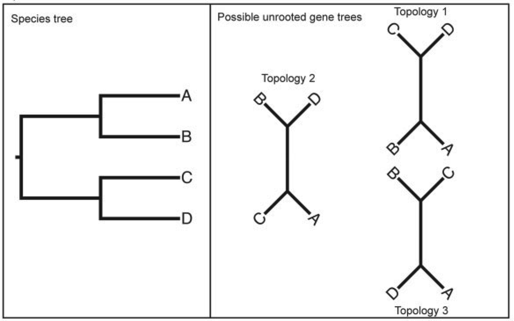

<script type="text/javascript" charset="utf-8" 
src="https://cdn.mathjax.org/mathjax/latest/MathJax.js?config=TeX-AMS-MML_HTMLorMML,
https://vincenttam.github.io/javascripts/MathJaxLocal.js"></script>


Phylogenetic networks are an extension of phylogenetic trees used to model gene flow events between species or populations (see the figure). Specifically, these  events are modelled by reticulation edges that summarizes gene flow that might have occurred over a period of time into a single instantaneous event. These edges have a parameter associated ($\varphi$) that represents the proportion of alleles transferred during the entire period of gene flow.

<p style="text-align:center;">
    
</p>
 
A popular method to estimate phylogenetic networks is <span style="font-variant: small-caps;">PhyloNetworks</span> ([Solís-Lemus et al. 2017](https://doi.org/10.1093/molbev/msx235)). It is based on a pseudolikelihood function over concordance factors (CFs) of quartets of taxa (four taxa), wich increase computational tractability. CFs are calculated as the proportion of gene trees supporting the three possible splits in a given quartet:
 
*CFs calculation*

Hence, it is required the estimation of gene trees to obtain the table of CFs required to estimate the network. Interestingly, an R function was developed to compute the table of CFs directly from a SNPs matrix ([Olave and Meyer 2020](https://doi.org/10.1093/sysbio/syaa005)), which we will be using here on the *Liolaemus* datset.

## Install Julia and <span style="font-variant: small-caps;">PhyloNetworks</span>

<span style="font-variant: small-caps;">PhyloNetworks</span> is a package of Julia, an interactive programming language (like R). To install Julia, go to [http://julialang.org/downloads/](http://julialang.org/downloads/).

To install the package, type inside Julia:

```julia
Pkg.add("PhyloNetworks");
using PhyloNetworks; # to load the package, analogous to R's `library(package)`
```

Let's load a toy tree with the `readTopology()` function to check that the package is correctly installed
```julia
net = readTopology("(A,(B,(C,D)));");
net
# HybridNetwork, Rooted Network
# 6 edges
# 7 nodes: 4 tips, 0 hybrid nodes, 3 internal tree nodes.
# tip labels: A, B, C, D
# (A,(B,(C,D)));
```

We loaded a tree but is says it is a network. This is not an error, by definition, trees are networks without reticulation edges.

## Calculation of Concordance Factors

Let's migrate to R to estimate the CF table from the SNPs matrix

## Network estimation

Now we return to Julia. We will load the CF table and an estimate of the species tree. This can be the tree inferred with `svdquartets`

```julia
Pkg.add("PhyloPlots") # to visualize the networks
using PhyloNetworks, PhyloPlots

CFfile = "btw_sp_100quart_boot.csv"
CFtable = readTableCF(CFfile)

sppTree_file = "starting_tree.tre";
sppTree = readTopology(sppTree_file);
```

Now we are ready to estimate a network. This will be accomplished with the `snaq!()` function. It estimates a network that fits observed quartet concordance factors (CFs) using maximum pseudo-likelihood. The argument `hmax` determines the maximum number of hybridizations allowed.
```julia
net_h1 = snaq!(sppTree, CFtable, hmax = 1, filename = "net1", runs = 1)
plot(net_h1, showgamma = true, style = :majortree, arrowlen = 0.2)

```

The networks returned by the method are not rooted, so it is convinient to include an outgroup species in the datset to properly root the networks after the estimation. In ur dataset, the outgroup species is *Liolaemus lineomaculatus*:
```julia
net_h1.names # explore the names of the terminals
rootatnode!(net_h1, "lineomaculatus") # root at the outgroup node
plot(net_h1, showgamma = true, style = :majortree, arrowlen = 0.2) # plot again
```